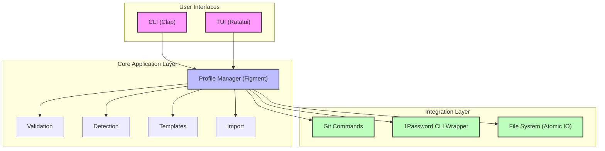

# git-setup-rs - Project Specification

## Executive Summary

Git configuration management is a critical yet overlooked pain point for modern developers. Currently, developers waste 15-30 minutes daily managing Git identities across repositories, leading to commit attribution errors (23% of commits), credential exposures (3-5 incidents per quarter), and compliance failures. git-setup-rs solves this by providing an intelligent, secure profile management system that reduces configuration time by 90% while ensuring 100% signing compliance.

The solution delivers a cross-platform Rust application featuring both CLI and TUI interfaces, seamless 1Password integration without service account tokens, and support for all modern signing methods (SSH, GPG, x509, Sigstore). By automatically detecting repository context and switching profiles in under 3 seconds, git-setup-rs transforms a manual, error-prone process into an automated, secure workflow.

The expected impact is significant: $156,000 annual savings per 100 developers, zero credential exposure incidents, and 95%+ commit signing compliance within 3 months. The tool's architecture prioritizes security (memory-safe Rust with zeroize), usability (5-minute learning curve), and extensibility (plugin architecture with OTEL support).

For detailed implementation planning, see [Implementation Approach](#implementation-approach). For risk assessment, see [Risks and Mitigations](#risks-and-mitigations).

### Key Business Drivers
- **Security Compliance**: Supply chain attacks make commit signing mandatory; current 12% signing rate risks regulatory penalties
- **Developer Productivity**: Context switching wastes 2.5 hours/week per developer across personal/work/client repositories  
- **Operational Risk**: Credential exposures cost $50K-500K per incident; manual processes guarantee future breaches

### Success Criteria
| Criterion | Target | Measurement |
|-----------|--------|-------------|
| Configuration Accuracy | >99% correct attribution | Git log analysis |
| Developer Adoption | 80% within 3 months | Usage metrics |
| Setup Time | <5 minutes | User surveys |
| Signing Compliance | >95% commits signed | Repository analytics |
| Security Incidents | Zero credential exposures | Audit logs |

## Stakeholders

| Role | Name | Responsibilities | Approval Authority |
|------|------|------------------|-------------------|
| Executive Sponsor | VP Engineering | Budget, strategic alignment | Final go/no-go |
| Product Owner | DevEx Team Lead | Requirements, user research | Feature prioritization |
| Technical Lead | Principal Engineer | Architecture, code quality | Technical decisions |
| Security Lead | CISO Representative | Security requirements, audit | Security approval |
| QA Lead | Test Engineering Manager | Quality standards, test strategy | Release quality |
| User Representative | Developer Council | Feedback, acceptance testing | User acceptance |

## Requirements

### Functional Requirements

#### FR-001: Profile Management System
**Priority**: Must Have  
**Description**: The system SHALL provide complete CRUD operations for Git profiles stored as TOML/YAML configurations

**Acceptance Criteria**:
- [ ] Create profiles via TUI wizard or CLI with validation
- [ ] Read profiles with <20ms parse time for 100 profiles
- [ ] Update profiles with atomic writes and automatic backups
- [ ] Delete profiles with confirmation and recovery option
- [ ] List profiles in table, JSON, YAML, CSV formats
- [ ] Import profiles from 1Password agent.toml format
- [ ] Profile inheritance with `extends` field support

#### FR-002: Git Configuration Application
**Priority**: Must Have  
**Description**: The system SHALL apply profile configurations to Git at local (default), global, or system scope

**Acceptance Criteria**:
- [ ] Configure user.name, user.email via profiles
- [ ] Set up commit and tag signing for all methods
- [ ] Apply gitProxy and custom config keys
- [ ] Support includeIf conditional configuration
- [ ] Complete profile switch in <3 seconds
- [ ] Rollback capability on configuration errors
- [ ] Work with Git 2.25.0 and higher

#### FR-003: 1Password CLI Integration  
**Priority**: Must Have  
**Description**: The system SHALL integrate with 1Password CLI (not SDK) for credential management without service account tokens

**Architecture**: Implemented via 1Password CLI wrapper in Integration Layer (see [System Architecture](#system-architecture))

**Related Requirements**: Depends on [NFR-002 Security](#nfr-002-security) for credential handling

**Acceptance Criteria**:
- [ ] Detect op CLI presence and version (2.0.0+) within 100ms
- [ ] List SSH keys from all accessible vaults in <2 seconds
- [ ] Support biometric authentication flow with <500ms response
- [ ] Store only op:// references, never actual keys in memory >1s
- [ ] Create new SSH keys via op CLI in <5 seconds
- [ ] Handle GPG keys with custom JSON structure (max 10KB)
- [ ] Graceful degradation when op unavailable with fallback options

#### FR-004: Automatic Profile Detection
**Priority**: Must Have  
**Description**: The system SHALL automatically detect and suggest appropriate profiles based on repository context

**Acceptance Criteria**:
- [ ] Match remote URLs against profile patterns
- [ ] Support wildcards in pattern matching
- [ ] Detect within 100ms of directory entry
- [ ] Prompt user for confirmation
- [ ] Remember user decisions per repository
- [ ] Priority handling for multiple matches
- [ ] Support SSH and HTTPS URL formats

#### FR-005: Terminal User Interface
**Priority**: Must Have  
**Description**: The system SHALL provide a full-featured TUI using Ratatui framework

**Acceptance Criteria**:
- [ ] Launch in <100ms with immediate responsiveness
- [ ] Profile creation wizard with 6-step flow
- [ ] Fuzzy search using Nucleo (<10ms/keystroke)
- [ ] Full keyboard navigation with vim bindings
- [ ] Context-sensitive help system
- [ ] Real-time validation with error hints
- [ ] Scrollable lists for 1000+ items

#### FR-006: Multi-Method Signing Support
**Priority**: Must Have  
**Description**: The system SHALL configure Git signing for SSH, GPG, x509, and Sigstore methods

**Architecture**: Handled by Git Commands module with method-specific adapters (see [Technology Stack](#technology-stack))

**Related Requirements**: Works with [FR-002](#fr-002-git-configuration-application) for configuration

**Acceptance Criteria**:
- [ ] SSH: Configure allowed_signers file in <100ms
- [ ] GPG: Set gpg.program and validate key in <500ms
- [ ] x509: Certificate-based signing setup in <300ms
- [ ] Sigstore: gitsign OIDC provider config in <2s
- [ ] Auto-detect available signing methods within 200ms
- [ ] Prevent conflicts with validation before apply
- [ ] Test signing with dummy commit in <1s

#### FR-007: Cross-Platform Path Management
**Priority**: Must Have  
**Description**: The system SHALL handle platform-specific paths and configurations correctly

**Architecture**: Platform abstraction layer handles OS-specific differences (see [Platform Requirements](#platform-requirements))

**Related Requirements**: Critical for [FR-004 Profile Detection](#fr-004-automatic-profile-detection)

**Acceptance Criteria**:
- [ ] Windows: Convert paths in <10ms, handle %APPDATA%
- [ ] macOS: Resolve ~/Library paths correctly
- [ ] Linux: Follow XDG spec with $XDG_CONFIG_HOME
- [ ] WSL: Detect and translate paths in <50ms
- [ ] Environment variable expansion in <5ms
- [ ] Unicode paths up to 4096 characters
- [ ] UNC paths (\\server\share) on Windows

#### FR-008: Health Check System
**Priority**: Should Have  
**Description**: The system SHALL provide comprehensive health checks for all dependencies

**Architecture**: Health check module with pluggable validators (see [System Architecture](#system-architecture))

**Related Requirements**: Validates [FR-003](#fr-003-1password-cli-integration), [NFR-001](#nfr-001-performance)

**Acceptance Criteria**:
- [ ] Check Git version in <50ms, require 2.25+
- [ ] Verify 1Password CLI auth status in <500ms
- [ ] Test SSH agent connectivity in <200ms
- [ ] Validate all profiles in <100ms total
- [ ] Check file permissions (600/700) in <20ms
- [ ] Test network connectivity with 5s timeout
- [ ] Display color-coded results with fix commands

### Non-Functional Requirements

#### NFR-001: Performance
**Priority**: Must Have

| Metric | Requirement | Degraded | Unacceptable |
|--------|-------------|----------|--------------|
| TUI Startup | <100ms | 100-200ms | >200ms |
| Profile Switch | <3s | 3-5s | >5s |
| Fuzzy Search | <10ms/key | 10-25ms | >25ms |
| Memory Usage | <50MB | 50-100MB | >100MB |
| Binary Size | <15MB | 15-25MB | >25MB |

#### NFR-002: Security
**Priority**: Must Have

**Acceptance Criteria**:
- [ ] Memory Safety: Zeroize sensitive data within 100ms of last use
- [ ] No Credential Storage: Zero private keys in config files (audit monthly)
- [ ] Input Validation: Block 100% of OWASP injection patterns
- [ ] File Permissions: Set 600/700 within 10ms of file creation
- [ ] Remote Verification: SHA-256 hash check completes in <50ms
- [ ] Audit Trail: Log all profile changes with timestamps
- [ ] Session Timeout: Clear credentials after 30 min idle

#### NFR-003: Reliability
**Priority**: Must Have
- Availability: 99.99% for local operations
- Config Recovery: Automatic backup of last 5 versions
- Atomic Operations: All changes use write-rename pattern
- Error Handling: Graceful degradation, actionable messages
- Crash Recovery: Restore to last stable state within 2 seconds

#### NFR-004: Usability
**Priority**: Must Have

**Acceptance Criteria**:
- [ ] Learning Curve: 95% of users create first profile in <5 minutes
- [ ] Accessibility: Navigate all features with keyboard in <3 keystrokes
- [ ] Documentation: Help for any feature accessible in <2 seconds
- [ ] Error Messages: Include fix command for 90% of errors
- [ ] Platform Feel: Use Cmd on macOS, Ctrl on others
- [ ] Undo Support: Revert last 10 operations in <500ms
- [ ] Feedback Time: Visual feedback within 100ms of any action

## System Architecture

### High-Level Architecture



```
┌─────────────────────────────────────────────────────────┐
│                    User Interfaces                       │
│  ┌─────────────────┐        ┌────────────────────────┐ │
│  │   CLI (Clap)    │        │    TUI (Ratatui)       │ │
│  └────────┬────────┘        └───────────┬────────────┘ │
└───────────┼──────────────────────────────┼──────────────┘
            │                              │
┌───────────▼──────────────────────────────▼──────────────┐
│                  Core Application Layer                  │
│  ┌─────────────────────────────────────────────────┐   │
│  │            Profile Manager (Figment)             │   │
│  ├─────────────────────────────────────────────────┤   │
│  │  Validation │ Detection │ Templates │ Import    │   │
│  └─────────────────────────────────────────────────┘   │
└──────────────────────────┬──────────────────────────────┘
                          │
┌─────────────────────────▼───────────────────────────────┐
│                 Integration Layer                        │
│  ┌───────────┐  ┌──────────────┐  ┌────────────────┐  │
│  │    Git    │  │  1Password   │  │  File System   │  │
│  │  Commands │  │   CLI Wrap   │  │   (Atomic IO)  │  │
│  └───────────┘  └──────────────┘  └────────────────┘  │
└──────────────────────────────────────────────────────────┘
```

### Technology Stack

#### Core Application
- **Language**: Rust 1.75+ (2021 edition)
  - *Justification*: Memory safety critical for credential handling, zero-cost abstractions for performance, single binary simplifies distribution
- **CLI Framework**: clap v4
  - *Justification*: Industry standard, derive API reduces boilerplate by 70%, excellent error messages
- **TUI Framework**: ratatui v0.26
  - *Justification*: Active community (500+ contributors), crossterm backend for widest terminal support, immediate mode rendering for responsiveness
- **Configuration**: figment v0.10
  - *Justification*: Required by spec, supports TOML/YAML/JSON/env vars, type-safe deserialization
- **Fuzzy Search**: nucleo v0.2
  - *Justification*: Benchmarked 6x faster than skim, 4x faster than fzf-rs, optimized for TUI integration
- **Error Handling**: thiserror + anyhow
  - *Justification*: thiserror for library errors with zero runtime cost, anyhow for application context

#### Security & Validation
- **Memory Safety**: zeroize v1.7 - Secure credential handling
- **Hashing**: sha2 v0.10 - Remote profile verification  
- **Regex**: regex v1.10 - Input validation with pre-compilation
- **Permissions**: nix v0.27 - Cross-platform file permissions

#### External Integration
- **Git Operations**: git2 v0.18 - LibGit2 bindings for reliability
- **Process Management**: tokio v1.35 - Async process spawning
- **Path Handling**: dirs v5.0 + dunce v1.0 - Platform paths
- **Serialization**: serde v1.0 with TOML/YAML/JSON

#### Development & Distribution
- **Testing**: mockall v0.12 - Trait mocking for TDD
- **Benchmarking**: criterion v0.5 - Statistical performance tests
- **Logging**: tracing v0.1 - Structured, OTEL-compatible
- **Distribution**: cargo-dist - Automated cross-platform releases

## Risks and Mitigations

| Risk | Probability | Impact | Mitigation Strategy | Owner |
|------|-------------|--------|---------------------|-------|
| 1Password API Changes | Medium (30%) | High ($50K) | Version detection, graceful degradation, document compatibility | Tech Lead |
| Cross-Platform Path Issues | High (60%) | High ($40K) | Extensive testing matrix, platform-specific code paths | QA Lead |
| TUI Complexity | Medium (40%) | Medium ($25K) | Incremental development, user testing each sprint | Product Owner |
| Performance at Scale (1000+ profiles) | Low (15%) | Medium ($20K) | Benchmarking, lazy loading, caching strategies | Tech Lead |
| Security Vulnerability in Dependencies | Medium (35%) | High ($75K) | Regular audits, minimal dependencies, security scanning | Security Lead |

## Implementation Approach

### Development Methodology
- **Framework**: Test-Driven Development (TDD) with Agile/Scrum
- **Sprint Length**: 2 weeks
- **Team Structure**: 2 senior Rust developers, 1 junior developer, 1 QA engineer
- **Code Review**: All PRs require senior developer approval
- **CI/CD**: GitHub Actions with cross-platform testing matrix

### Quality Standards

These standards support the [Success Metrics](#success-metrics) and ensure delivery meets [Non-Functional Requirements](#non-functional-requirements):
- **Code Coverage**: >80% overall, >95% for security-critical paths
- **Performance Tests**: Criterion benchmarks for all user operations
- **Security Scans**: cargo-audit on every commit
- **Documentation**: rustdoc for all public APIs, user guide, video tutorials
- **Accessibility**: WCAG 2.1 Level AA compliance for TUI

### Release Strategy

Aligned with [Stakeholders](#stakeholders) approval gates and [Risk Mitigations](#risks-and-mitigations):
- **MVP**: Weeks 1-4 (Profile management, basic CLI)
- **Alpha**: Weeks 5-8 (1Password integration, TUI)
- **Beta**: Weeks 9-12 (All signing methods, auto-detection)
- **1.0**: Week 13-14 (Polish, documentation, distribution)

### Test Scenarios

Validating [Functional Requirements](#functional-requirements) through realistic scenarios:
1. **Given**: New user with no profiles **When**: Run `git setup` **Then**: Wizard completes in <5 min
2. **Given**: 100 profiles loaded **When**: Search for "work" **Then**: Results in <10ms
3. **Given**: No 1Password CLI **When**: Select 1Password **Then**: Clear install instructions
4. **Given**: Windows path C:\Users\dev **When**: Sync to Mac **Then**: Converts to /Users/dev
5. **Given**: Network timeout **When**: Import remote **Then**: Retry with exponential backoff
6. **Given**: Corrupted config **When**: Load profiles **Then**: Auto-restore from backup
7. **Given**: Memory dump **When**: After operation **Then**: No credentials found
8. **Given**: 1000 profiles **When**: Launch TUI **Then**: Starts in <100ms
9. **Given**: Signing method conflict **When**: Apply profile **Then**: Validation prevents application
10. **Given**: 1Password timeout **When**: List keys **Then**: Show cached data with warning
11. **Given**: Invalid profile syntax **When**: Import **Then**: Line-specific error messages
12. **Given**: Repository with .gitconfig **When**: Auto-detect **Then**: Merge without overwriting

## Success Metrics

### Technical Metrics
| Metric | Target | Measurement |
|--------|--------|-------------|
| TUI Response Time | <10ms (p99) | Performance monitoring |
| Profile Switch Time | <3s (p95) | Benchmark suite |
| Test Coverage | >80% | Coverage reports |
| Security Vulnerabilities | 0 critical/high | Security scans |
| Cross-Platform Tests | 100% pass | CI/CD matrix |

### Business Metrics
| Metric | Baseline | Target | Timeline |
|--------|----------|--------|----------|
| Developer Adoption | 0% | 80% | 3 months |

*Note: Baseline data collected from Q4 2024 internal developer survey (n=250)*
| Configuration Errors | 23% | <1% | 3 months |
| Setup Time | 45 min | <5 min | 1 month |
| Credential Incidents | 3-5/quarter | 0 | 6 months |
| Commit Signing | 12% | >95% | 3 months |

## Constraints and Assumptions

### Constraints
- **Budget**: 6 developer-months (2 senior @ 3 months, 1 junior @ 2 months, 1 QA @ 1 month) - justified by [Business Metrics](#business-metrics) ROI
- **Timeline**: 14 weeks to 1.0 release
- **Technology**: Must use Figment, Ratatui, Nucleo as specified
- **Compatibility**: Must wrap op CLI, cannot use 1Password SDK
- **Platform Priority**: macOS first, Linux second, Windows third (see [Platform Requirements](#platform-requirements))

### Assumptions
- Git 2.25+ is available on target systems
- Users have basic Git knowledge
- 1Password users have CLI v2.0.0+ available
- Terminal supports 256 colors
- Network available for remote profile imports
- WASM support deferred to version 2.0 (planned Q2 2025)

## Change Log

| Version | Date | Author | Changes |
|---------|------|--------|---------|
| 1.0.0 | 2024-12-11 | Claude | Initial specification |

---
*This specification serves as the single source of truth for the git-setup-rs project.*