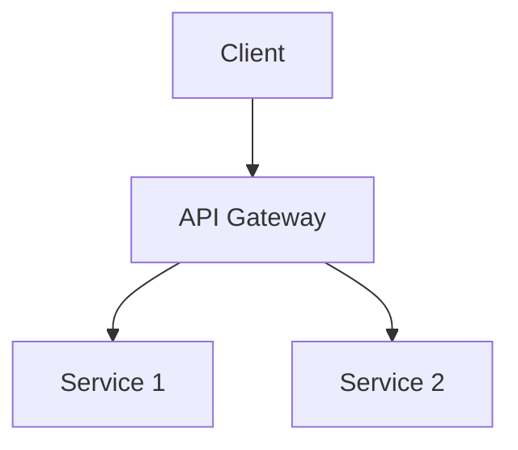

# Spec Improvement Suggestions

Generated for: SPEC.md

## High Priority

- **Issue**: Vague timeline terms found: future
  - **Suggestion**: Replace with specific dates or durations
  - **Example**: Instead of 'future enhancement', use 'Phase 2 (Month 4-6)'

- **Issue**: Success metrics lack baseline data
  - **Suggestion**: Add current state metrics for comparison
  - **Example**: For each metric, show: Current → Target

## Medium Priority

- **Issue**: Architecture section lacks diagrams
  - **Suggestion**: Add system architecture diagram
  - **Example**: Add a Mermaid diagram:

- **Issue**: No deployment architecture described
  - **Suggestion**: Add deployment architecture section
  - **Example**: Add section:
### Deployment Architecture
- Environment strategy (dev/staging/prod)
- Container orchestration
- Scaling approach
- Monitoring and logging

